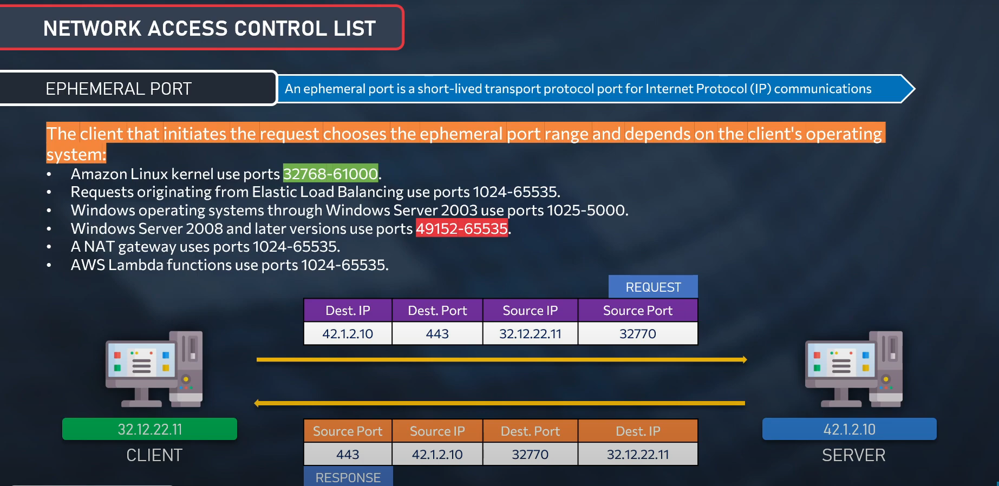

# Network Access Control List (NACL)

A **network access control list (ACL)** is an optional layer of security for your VPC that **acts as a firewall for controlling traffic in and out of one or more subnets**.

## NACL Basics

1. **VPC automatically comes with a modifiable default network ACL.** By default, it allows all inbound and outbound IPv4 traffic.
2. You can create a custom network ACL and associate it with a subnet.
3. Each subnet in your VPC must be associated with a network ACL.
4. **You can associate a network ACL with multiple subnets**.
   - A subnet can be associated with only one network ACL at a time.
5. **A network ACL contains a numbered list of rules**:
   - Rules are evaluated in order of the number of the rule.
   - The highest number that you can use for a rule is **32766**.
   - You can create rule numbers like **100, 150, 200, 250**.
6. Network ACL has separate inbound and outbound rules, and each rule can either allow or deny traffic.
7. Network ACLs are stateless.

## Quota for NACL

| Resource | Default |
|----------|---------|
| Network ACLs per VPC | 200 |
| Rules per network ACL | 20 |

---

## Network ACL Rules

### Inbound Rules

| Rule # | Type | Protocol | Port Range | Source | Allow/Deny |
|--------|------|----------|------------|--------|------------|
| 100    | All IPv4 traffic | All | All | 0.0.0.0/0 | ALLOW |
| *      | All IPv4 traffic | All | All | 0.0.0.0/0 | DENY  |
| 120    | SSH  | TCP | 22 | 192.0.2.0/24 | ALLOW |

### Rule Definitions

| Resource | Default |
|----------|---------|
| **Rule Number** | Rules are evaluated starting with the lowest numbered rule. |
| **Type** | The type of traffic; for example, SSH (all traffic or a custom range). |
| **Protocol** | Specify any protocol that has a standard protocol number. |
| **Port Range** | The listening port or port range for the traffic. For example, 80 for HTTP traffic. |
| **Source** | [Inbound rules only] The source of the traffic (CIDR range). |
| **Destination** | [Outbound rules only] The destination for the traffic (CIDR range). |
| **Allow/Deny** | Whether to allow or deny the specified traffic. |

# Difference between NACL and Security Groups

| Parameter                  | Network ACL (NACL) | Security Group (SG)   |
|----------------------------|--------------------|------------------------|
| Rules Type                 | Allow & Deny       | Allow only             |
| Association                | Subnet             | EC2 (ENI)              |
| State                      | Stateless          | Stateful               |
| Rules Evaluation           | Processed in order | All rules evaluated    |
| Defence Layer - Inbound    | First layer        | Second layer           |
| Defence Layer - Outbound   | Second layer       | First layer            |
| Attachment                 | 1 per subnet       | Multiple per EC2       |
| Destination                | CIDR               | CIDR, IP, other SG     |
| Operates at                | Subnet level       | Instance level         |
| Supports Return Traffic    | Not automatic      | Automatic              |
| Default Coverage           | Automatically applies to all instances in the associated subnets | Applies only to instances with the assigned SG |
| Scope                      | Additional layer of defense if SG rules are too permissive | Primary instance-level defense |